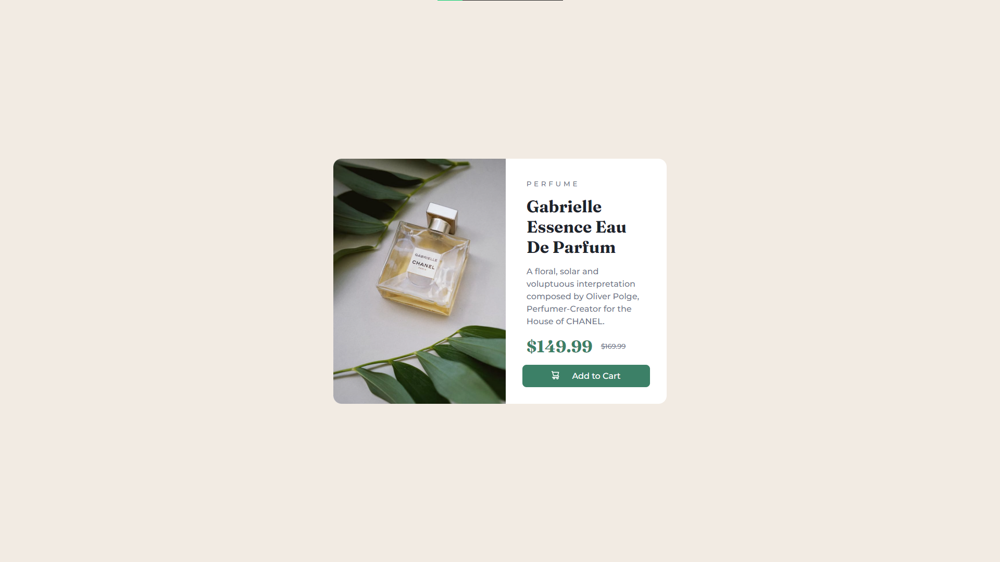
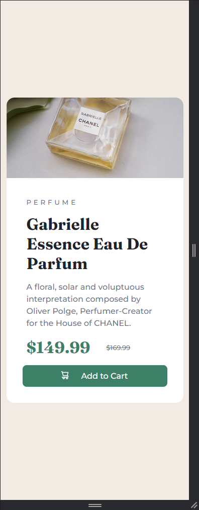

# Frontend Mentor - Product preview card component solution

This is a solution to the [Product preview card component challenge on Frontend Mentor](https://www.frontendmentor.io/challenges/product-preview-card-component-GO7UmttRfa). Frontend Mentor challenges help you improve your coding skills by building realistic projects.

## Table of contents

- [Overview](#overview)
  - [The challenge](#the-challenge)
  - [Screenshot](#screenshot)
  - [Links](#links)
- [My process](#my-process)
  - [Built with](#built-with)
  - [What I learned](#what-i-learned)
  - [Continued development](#continued-development)
  - [Useful resources](#useful-resources)
- [Author](#author)

## Overview

### The challenge

Users should be able to:

- View the optimal layout depending on their device's screen size
- See hover and focus states for interactive elements

### Screenshot




### Links

- Live Site URL: [Product Preview Card Component](https://eparem-product-preview.netlify.app/)

## My process

### Built with

- Media Queries
- Pseudo Classes
- CSS custom properties
- Flexbox
- Mobile-first workflow
- Vanilla

### What I learned

I've learned to use Flexbox and discovered that I need to reuse a `display: flex` if if I want to change the direction of them again.
And I've also learned how to use media queries and even transitions and learned about pseudo-classes such as `:hover` and `:focus`!

_I'll need to dig further into transitions_

I also had issues with the `` tag in this project since I had to switch between the mobile image and the desktop image.

I've used a `<div>` instead with a `background-image` which allows me, with the media queries to switch urls!

But I've also noticed that the image takes a bit to load after switching between the mobile and desktop view, only happen once, but I'd love to know a way to avoid that.

```css
a:hover,
a:focus {
  background-color: hsl(156, 42%, 18%);
  outline: none;
}
```

```html
<div class="image"></div>
```

```css
.image {
  background-image: url("./assets/image-product-mobile.jpg");
  [...]
}

@media (min-width: 50rem) {
  .card {
    width: 40rem;
    flex-direction: row;
  }

  .image {
    background-image: url("./assets/image-product-desktop.jpg");
    height: 100%;
    width: 200%;
    border-radius: 1rem 0 0 1rem;
  }
}
```

### Continued development

I want to focus on pseudo classes and such, apparently there's a lot of use cases that can now be resolved using pseudo classes.

So i'll definitely have a deeper look at that.

### Useful resources

- [MDN Web Docs Mozilla | Pseudo Classes](https://developer.mozilla.org/en-US/docs/Web/CSS/Pseudo-classes) Mozilla always to the rescue with documentation.

## Author

- Frontend Mentor - [@RemEpau](https://www.frontendmentor.io/profile/RemEpau)
